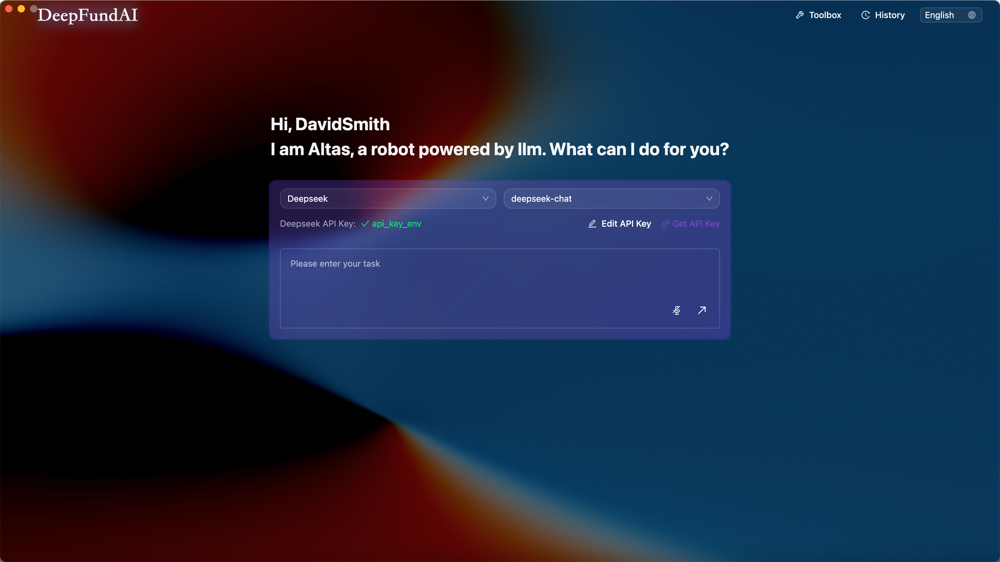
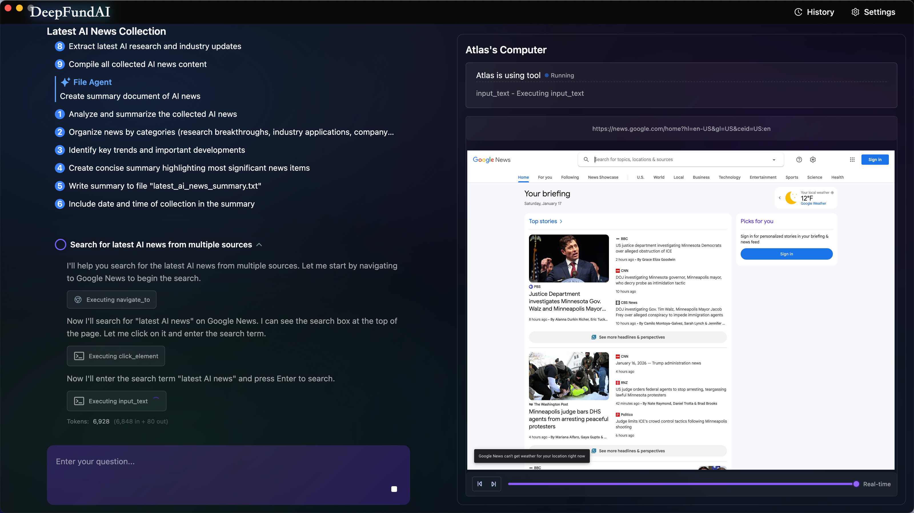
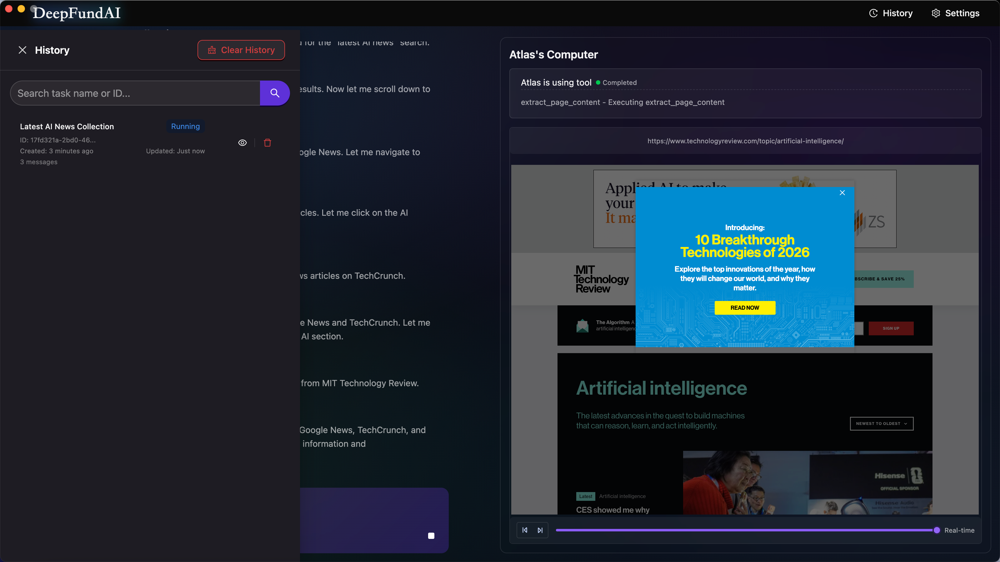
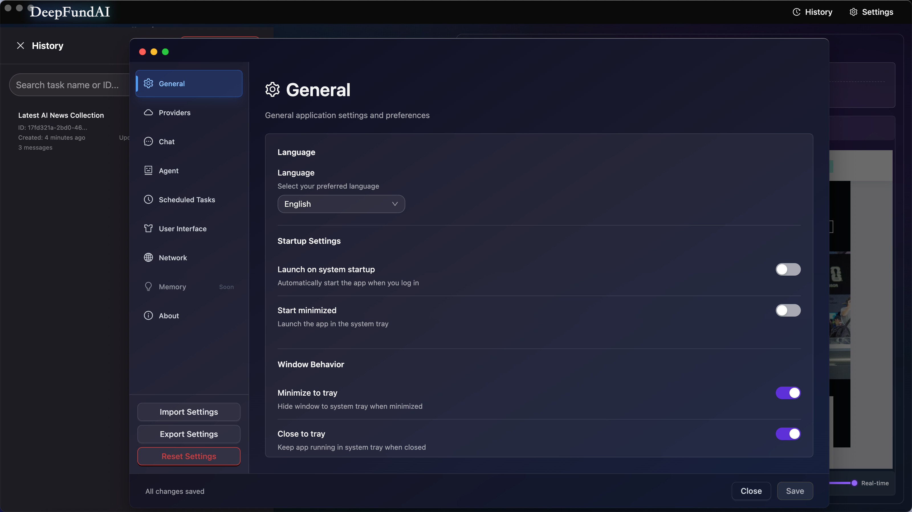

# AI Browser

[English](./README.md) | [简体中文](./README.zh-CN.md)

一个基于 Next.js 和 Electron 构建的 AI 智能浏览器。支持多模态 AI 任务执行、定时任务、社交媒体集成以及高级文件管理功能，并支持多个 AI 提供商。

基于 [Next.js](https://nextjs.org) 和 [Electron](https://electronjs.org) 构建。

## 技术栈

- **前端**: Next.js 15 + React 19
- **桌面应用**: Electron 33
- **UI**: Ant Design + Tailwind CSS
- **状态管理**: Zustand
- **存储**: IndexedDB (via electron-store)
- **AI Agent**: @jarvis-agent (基于 [Eko](https://github.com/FellouAI/eko) - 生产就绪的 Agent 框架)
- **构建工具**: Vite + TypeScript

## 开发环境配置
Node 版本: 20.19.3

## 快速开始

### 1. 开发环境设置

首先，运行开发服务器：

```bash
# 安装依赖
pnpm install

# 构建桌面应用客户端
pnpm run build:deps

# 启动 Web 开发服务器
pnpm run next

# 启动桌面应用
pnpm run electron
```

### 2. 配置 API 密钥（启动后）

启动应用后：

1. 点击右上角的**设置**图标（⚙️）
2. 进入 **Providers**（提供商）面板
3. 选择你的 AI 提供商（DeepSeek、Qwen、Google Gemini、Claude 或 OpenRouter）
4. 点击**编辑 API 密钥**并输入你的 API 密钥
5. 点击勾选标记保存

详细配置说明请参见 [CONFIGURATION.zh-CN.md](./docs/CONFIGURATION.zh-CN.md)。

### 3. 构建桌面应用

构建用于分发的桌面应用：

```bash
# 构建应用
pnpm run build
```

**注意**：终端用户安装后将通过设置界面配置 API 密钥，无需环境文件。

## 功能特性

- **多 AI 提供商支持**: 支持 DeepSeek、Qwen、Google Gemini、Anthropic Claude 和 OpenRouter
- **完整的设置系统**: 通过 UI 配置一切 - 无需编辑文件
  - **Providers（提供商）**: API 密钥、模型和提供商特定设置
  - **General（通用）**: 语言、启动行为、窗口偏好
  - **Chat（对话）**: 温度、最大令牌、流式传输和对话行为
  - **Agent（智能体）**: 浏览器/文件代理设置、自定义提示词、MCP 工具
  - **UI（界面）**: 主题（深色/浅色/跟随系统）、字体大小、密度、编辑器偏好
  - **Network（网络）**: 代理、请求超时、流超时、重试次数
- **定时任务**: 创建和管理具有自定义间隔的自动化定期任务
- **AI 智能浏览器**: 具有自动化任务执行的智能浏览器
- **多模态 AI**: 视觉和文本处理能力
- **语音识别与 TTS**: 语音识别和文字转语音集成
- **文件管理**: 高级文件操作和管理
- **国际化**: 完整的中英文语言支持

## 产品路线图

### ✅ 已完成功能

**v0.0.1 - v0.0.4: 核心功能**
- AI 智能浏览器与自动化任务执行
- 多 AI 提供商支持（DeepSeek、Qwen、Google Gemini、Claude、OpenRouter）
- 多模态 AI 能力（视觉和文本处理）
- 定时任务系统（支持自定义执行间隔）
- 文件管理功能
- API 密钥和模型的 UI 配置

**v0.0.5 - v0.0.7: UI/UX 增强**
- 紫色主题重新设计，改进 UI/UX
- Agent 配置系统（自定义提示词、MCP 工具管理）
- 工具箱页面（功能集中访问中心）
- 国际化支持（中英文切换）
- WebGL 动画背景（带渐变降级方案）
- 优化模态框尺寸和布局

**v0.0.8 - v0.0.10: 高级功能**
- 人机交互支持（AI 执行过程中可主动提问）
- 任务续传与文件附件管理
- 基于原子片段的历史回放（支持打字机效果）
- 高级回放控制（播放/暂停/重启/速度调节）
- 上下文恢复与会话管理
- 消息自动滚动优化
- 增强的消息展示和渲染

**v0.0.11+: 统一设置系统**
- 全新设置界面，包含 6 个面板（Providers、General、Chat、Agent、UI、Network）
- 使用 electron-store 统一配置管理
- 所有设置通过 UI 配置 - 无需手动编辑文件
- 所有窗口实时同步设置
- 支持导入/导出/重置所有设置
- 深色/浅色/跟随系统主题支持，平滑过渡
- 网络配置（代理、超时、重试）
- 定时任务系统（使用 IndexedDB 存储）

### 🚀 未来规划

**阶段 1: 用户体验增强**
- 语音输入支持（语音转文字集成）
- 主题定制系统（多种配色方案）
- 深色/浅色模式切换
- 增强的无障碍功能

**阶段 2: 工作流增强**
- Workflow 配置的导出/导入功能
- 基于 Workflow 配置重构定时任务步骤结构
- 可视化工作流编辑器（支持拖拽）
- 步骤管理（重新排序、新增、删除、编辑工作流步骤）
- 工作流模板和预设

**阶段 3: 插件生态系统**
- MCP 插件市场
- 社区插件分享平台
- 插件版本管理系统
- 一键安装和更新插件
- 插件开发工具包和文档

**阶段 4: 高级能力**
- 多标签页浏览器支持
- 协作式任务执行
- 任务和配置的云端同步
- 移动端配套应用
- 性能优化和缓存改进

## 截图

### 启动动画
应用启动时的动画加载界面。


### 首页
简洁清爽的界面 - 输入任务，让 AI 自动执行。



### 任务执行
左侧：AI 思考过程和执行步骤。右侧：实时浏览器操作预览。



### 历史记录
查看过去的任务，支持搜索和回放功能。



### 设置界面
完整的设置界面包含 8 个面板：
- **General（通用）**: 语言、启动行为、窗口偏好
- **Providers（提供商）**: AI 提供商选择和 API 密钥管理
- **Chat（对话）**: 温度、最大令牌和对话行为
- **Agent（智能体）**: 浏览器/文件代理设置和 MCP 工具
- **Scheduled Tasks（定时任务）**: 创建和管理自动化任务
- **User Interface（用户界面）**: 主题、字体大小、密度偏好
- **Network（网络）**: 代理、超时和重试配置
- **Memory（记忆）**: 上下文管理设置（即将推出）



## 支持的 AI 提供商

- **DeepSeek**: deepseek-chat, deepseek-reasoner
- **Qwen (阿里云)**: qwen-max, qwen-plus, qwen-vl-max
- **Google Gemini**: gemini-1.5-flash, gemini-2.0-flash, gemini-1.5-pro 等
- **Anthropic Claude**: claude-3.7-sonnet, claude-3.5-sonnet, claude-3-opus 等
- **OpenRouter**: 多个提供商（Claude、GPT、Gemini、Mistral、Cohere 等）

## 文档

- [配置指南](./docs/CONFIGURATION.zh-CN.md) - 详细的 API 密钥设置说明

## 致谢

特别感谢 [Eko](https://github.com/FellouAI/eko) - 一个生产就绪的 Agent 框架，为本项目提供了 AI 能力支持。

## 社区与支持

⭐ 如果你觉得这个项目有帮助，请考虑给它一个 star！你的支持帮助我们成长和改进。

- 在 [GitHub Issues](https://github.com/DeepFundAI/ai-browser/issues) 上报告问题
- 加入讨论并分享反馈
- 贡献代码让 AI Browser 变得更好

### Star 历史

[](https://star-history.com/#DeepFundAI/ai-browser&Date)

## 贡献

欢迎贡献！提交 Pull Request 前请先阅读我们的贡献指南。

**重要提示**：永远不要将实际的 API 密钥提交到仓库。使用设置界面配置你的开发环境。

## 开源协议

本项目采用 MIT 协议开源 - 详见 [LICENSE](LICENSE) 文件。
